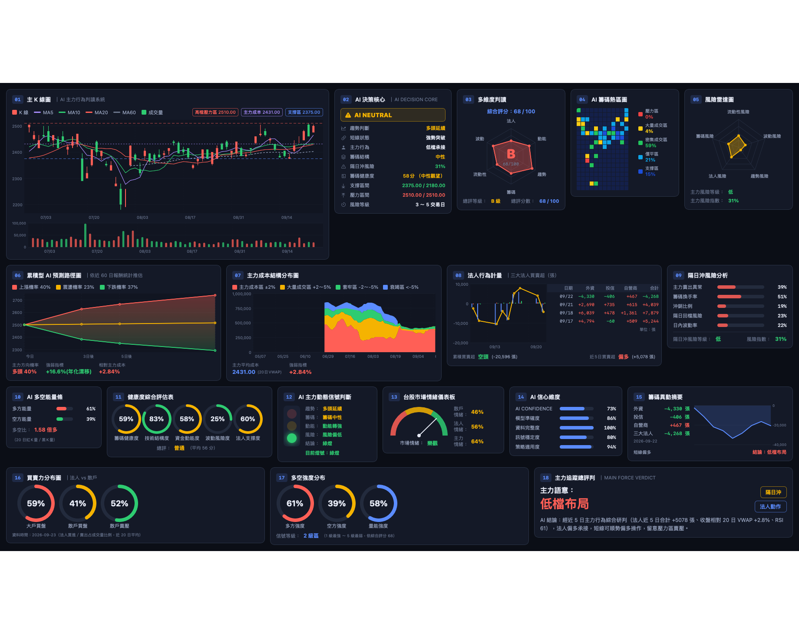
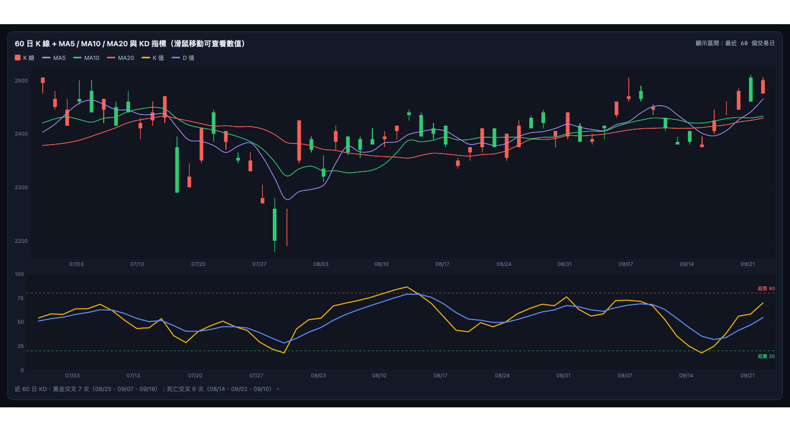
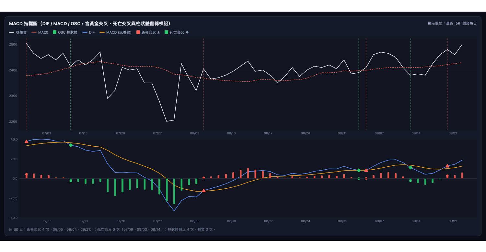
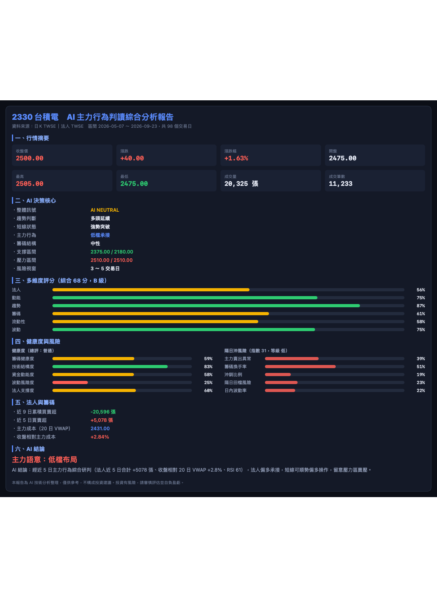

# TWStockAI — 台股 AI 主力行為判讀系統（macOS）

以 SwiftUI 打造的 macOS 原生股票查詢與技術分析應用程式。輸入股票代號後，會抓取**證交所／櫃買中心的真實公開資料**，即時計算技術指標、產生 18 面板 AI 儀表板與四大任務報告。

本專案依據 `股票查詢系統參考圖/` 內的 4 張網頁版參考設計，以原生桌面應用重新實作。

## 畫面

### AI 儀表板（18 面板）



### 任務三：KD + MA 圖表



### 任務四：MACD 圖表



### 任務一：綜合分析報告



> 以上皆為實際查詢 2330 台積電後的畫面，資料取自證交所公開資訊。

## 功能總覽

### AI 儀表板（18 個分析面板）

| 編號 | 面板 | 內容 |
| --- | --- | --- |
| 01 | 主 K 線圖 | K 線 + MA5/10/20/60 + 成交量，並標註壓力區、主力成本、支撐區 |
| 02 | AI 決策核心 | 趨勢判斷、短線狀態、主力行為、籌碼結構、支撐壓力區間、風險視窗 |
| 03 | 多維度判讀 | 法人／動能／趨勢／籌碼／流動性／波動 六面向雷達圖與綜合評級 |
| 04 | AI 籌碼熱區圖 | 時間 × 價格的成交量密度矩陣，含五種價格帶佔比 |
| 05 | 風險雷達圖 | 流動性、波動、趨勢、法人、籌碼五類風險 |
| 06 | 累積型 AI 預測路徑 | 依近 60 日報酬統計推估 3／5／10 日後價格區間 |
| 07 | 主力成本結構分布 | 成交量落在各價格帶的堆疊面積圖 |
| 08 | 法人行為計量 | 外資／投信／自營商逐日買賣超與合計 |
| 09 | 隔日沖風險分析 | 主力賣出異常、換手率、沖銷比例、回檔風險、日內波動率 |
| 10 | AI 多空能量條 | 近 20 日紅 K 量／黑 K 量能量比 |
| 11 | 健康度綜合評估 | 籌碼健康、技術結構、資金動能、波動風險、法人支撐五環 |
| 12 | 主力動態信號 | 紅黃綠號誌燈與逐項結論 |
| 13 | 市場情緒儀表板 | 半圓儀表與散戶／法人／主力情緒 |
| 14 | AI 信心維度 | 信心、模型準確度、資料完整度、訊號穩定度、策略適用度 |
| 15 | 籌碼異動摘要 | 最新一日法人動向與累積淨額走勢 |
| 16 | 買賣力分布圖 | 大戶買盤、散戶買盤、散戶賣壓 |
| 17 | 多空強度分布 | 多方、空方、量能強度與信號等級 |
| 18 | 主力追蹤總評判 | 主力語意與 AI 文字結論 |

### 四大任務分頁

- **任務一：綜合分析報告** — 條列式完整報告，可直接輸出 PDF
- **任務二：技術警示報告** — 均線、KD、MACD、量能、法人五類警示，可依嚴重度篩選
- **任務三：KD + MA 圖表** — 60 日 K 線 + MA5/10/20 與 KD 指標，滑鼠移動可查看逐日數值
- **任務四：MACD 圖表** — DIF／MACD／OSC，標記黃金交叉、死亡交叉與柱狀體翻轉
- **原始資料表** — 逐日價量與所有指標明細，可排序與日期篩選

### 匯出

儀表板 PNG、K 線圖 PNG、資料 CSV（UTF-8 with BOM，Excel 可直接開啟）、離線 HTML 報告、PDF。

## 資料來源

| 類型 | 來源 | 說明 |
| --- | --- | --- |
| 上市個股日 K | 證交所 `STOCK_DAY` | 逐月抓取，預設取最近 98 個交易日 |
| 上櫃個股日 K | 櫃買中心 `afterTrading/tradingStock` | TWSE 查無資料時自動切換 |
| 三大法人買賣超 | 證交所 `T86` | 逐日抓取最近 12 個交易日 |

皆為公開資料、免申請金鑰。**兩個來源都失敗時會直接回報錯誤，不會產生任何模擬數據。**

### 缺資料時的處理

上櫃股票沒有 TWSE 的三大法人公告，此時所有法人相關項目一律**標示為「無資料」**，不以中性值或推估值填補：

| 項目 | 有法人資料 | 無法人資料 |
| --- | --- | --- |
| 多維度雷達「法人」軸 | 0～100 分 | 標示「無資料」，頂點不繪製 |
| 綜合評分 | 六面向平均 | 其餘五面向平均（畫面會註明） |
| 健康度「法人支撐度」 | 0～100 分 | 虛線環 + 「無資料」 |
| 風險雷達「法人風險」 | 0～100 分 | 標示「無資料」，不計入 |
| 市場情緒「法人情緒」 | 百分比 | 「無資料」 |
| 主力行為 / 主力語意 | 依法人買賣超研判 | 依價量研判，並標註「（價量推估）」 |
| AI 結論 | 含法人淨額 | 明講「無三大法人公開資料」，全文不出現法人推論 |

籌碼分數與隔日沖風險的「主力賣出異常」在缺法人資料時改由價量推導（收盤相對 20 日 VWAP、上影線佔比、量能倍數），屬純價量訊號，不會冒充法人動向。

## 環境需求

- macOS 13.0（Ventura）以上
- Xcode 15.0 以上（Swift 5.9、Swift Charts）

## 開始使用

```bash
# 開啟專案
open TWStockAI.xcodeproj

# 或用命令列建置與執行
xcodebuild -project TWStockAI.xcodeproj -scheme TWStockAI -configuration Debug build
open ~/Library/Developer/Xcode/DerivedData/TWStockAI-*/Build/Products/Debug/TWStockAI.app
```

在 Xcode 中直接按 ⌘R 即可執行（專案已設定為 Sign to Run Locally，不需開發者帳號）。

### 操作方式

1. 在起始畫面輸入股票代號（例如 `2330`），或點選快速選擇按鈕
2. 按下「開始分析」或 Enter
3. 以上方分頁切換儀表板與四大任務報告
4. 以工具列按鈕匯出 PNG／CSV／HTML／PDF

快捷鍵：`⌘R` 重新分析、`⌘⇧N` 回到起始畫面、`⌘N` 開新視窗。

## 專案結構

```
TWStockAI/
├── App/              進入點與應用程式狀態（AppState）
├── Models/           日 K、法人買賣超等資料模型
├── Services/         TWSE／TPEx 用戶端、資料聚合、匯出、HTML 報告
├── Analytics/        技術指標引擎與 AI 判讀引擎（全純函式）
├── Theme/            深色主題配色與格式化工具
└── Views/
    ├── Components/   面板外框、雷達圖、熱區圖、儀表、圖表工具
    └── Panels/       18 個儀表板面板
TWStockAITests/       單元測試、功能測試、線上整合測試、版面渲染測試
TWStockAIUITests/     端對端（E2E）測試
tools/                Xcode 專案產生腳本
```

### 設計原則

- **函式式優先**：指標與分析引擎全為純函式（無狀態、無副作用），輸入相同必得相同輸出
- **可解釋**：所有分數與結論皆由明確規則推導，不使用亂數
- **容錯**：單筆資料格式異常時略過該筆，不讓整次查詢失敗
- **繁體中文**：介面、註解、文件一律使用繁體中文（台灣用語）

## 測試

```bash
# 單元測試 + 功能測試（不需網路，共 34 項）
xcodebuild test -project TWStockAI.xcodeproj -scheme TWStockAI \
  -destination 'platform=macOS' -only-testing:TWStockAITests

# 包含線上整合測試與版面渲染測試（會實際連線證交所）
RUN_LIVE_TESTS=1 xcodebuild test -project TWStockAI.xcodeproj -scheme TWStockAI \
  -destination 'platform=macOS'

# 端對端 UI 測試（需先於「系統設定 → 隱私權與安全性 → 輔助使用」授權 Xcode）
xcodebuild test -project TWStockAI.xcodeproj -scheme TWStockAI \
  -destination 'platform=macOS' -only-testing:TWStockAIUITests
```

| 測試層級 | 檔案 | 內容 |
| --- | --- | --- |
| 單元 | `IndicatorsTests`、`ParsingTests` | SMA／EMA／KD／MACD／RSI／VWAP 數學驗證、民國年與數值解析 |
| 功能 | `AIAnalyzerTests`、`MarketDataServiceTests` | 分析輸出完整性與範圍、以 `URLProtocol` 模擬交易所回應驗證抓取流程與備援切換 |
| 整合 | `LiveAPIIntegrationTests` | 實際連線 TWSE／TPEx（需 `RUN_LIVE_TESTS=1`） |
| 版面 | `SnapshotRenderingTests` | 離屏渲染各分頁為 PNG，驗證版面可完整繪製 |
| E2E | `AppFlowUITests` | 啟動 App、輸入代號、切換五個分頁 |

## 重新產生 Xcode 專案

新增或刪除 Swift 檔案後執行：

```bash
python3 tools/generate_xcodeproj.py
```

`project.pbxproj` 由腳本產生，不需手動維護。

## 免責聲明

本程式為技術分析整理工具，僅供參考，**不構成投資建議**。投資有風險，請審慎評估並自負盈虧。盤中數據可能即時變動，請依實際成交與官方資訊為準。
